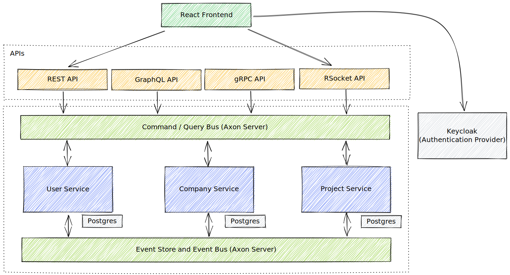

# YATT - *Y*et *A*nother *T*ask management *T*ool 

This repo contains a demo application from the context of project/task management. It is build using event sourcing and CQRS patterns and uses the [Axon Framework](https://developer.axoniq.io/axon-framework/overview) and [Axon Server](https://developer.axoniq.io/axon-server/overview). Furthermore, it showcases different API Technologies (REST, [GraphQL](https://graphql.org), [gRPC](https://grpc.io) and [RSocket](https://rsocket.io)) and how they can be implemented using Spring / Spring Boot. 

The APIs are build as separate spring boot applications that all use the axon services via the command and query bus provided by the Axon Framework. We use the implementation of the buses and event store provided by the Axon Server.

The repo also contains a simple UI based on React. Since we aren't as deep into fancy frontend development as we are in the backend, please bare with us that the frontend is a little bit hacked :-)

## Component Structure

### Frontend

As mentioned above, we build a simple React frontend supporting the main use cases of this demo app. You can  maintain companies and their employees, create projects, invite users as participants and manage tasks with their todos. The react app uses the REST API as well as the RSocket API (mainly to subscribe to streams of live updates from the backend services).

### APIs

We have used this repo and the demo app to build APIs using different technologies / protocols to show how they are supported by Spring / Spring Boot and to investigate what their specific pros and cons are.  

#### REST API

The REST API offers all functionality of the backend services. It contains a POST endpoint per available command (Command Side) and GET endpoints to fetch data (Query Side). 

#### GraphQL API

The GraphQL API offers mutations for (not yet) all available commands as well as queries and subscriptions to fetch data or to subscribe to updates of various parts of the data (Query Side). The GraphQL API is exposed via HTTP as well as via Websockets to support subscriptions.

#### gRPC API

The gRPC API is not yet complete but already exposes a large part of the available commands and queries. REQUEST-STREAM interactions allow to subscribe to updates of certain part of the data.

#### RSocket API

The RSocket API is also not yet complete but already exposes a large part of the available command and queries. REQUEST-STREAM interactions allow to subscribe to updates of certain part of the data.

### Backend Services (using AXON Framework)

The backend services use the AXON Framework to implement various aggregates, command handlers to interact with these aggregates as well as projections to provide the query side of the CQRS pattern. All aggregates are event-sourced.

#### User Service

The user service implements the user aggregate which represents a registered user on the platform. So far, there are not many available commands for users, the system just allows to change the name of the user once the user is registered.  

#### Company Service

The company service implements the company aggregate which represents a company that is registered on the platform (as kind of a customer in a SaaS-sense, or example). User can be assigned to companies becoming employees of that company. An employee is modelled as its own aggregate. Various commands allow to grant or revoke privileges to employees. 

#### Project Service

The project service is the main service in this example. It contains a few aggregates allowing to manage projects with tasks and todos. User working for a company as an employee can become project participants and therewith get access to a project. A user must have the project manager permission as an employee of a company in order to create a new project. 

### Demo-Data Importer

This application sends commands to the backend services to generate demo data on a blank environment. Run it once when the docker images have been started to get some randmon data into the system.

### Infrastructure Components

All required infrastructure services are available as a [docker compose file](docker/docker-compose.yaml)

#### Keycloak (OAuth Provider)

We use keycloak as an OAuth provider for the application. 

#### Postgres Database

Postgres is used to store projection data and serve queries on this.

#### Axon Server (Standard Edition)

Axon Server is used as the command and query bus implementation as well as the event store and event bus implementation for Axon Framework.

